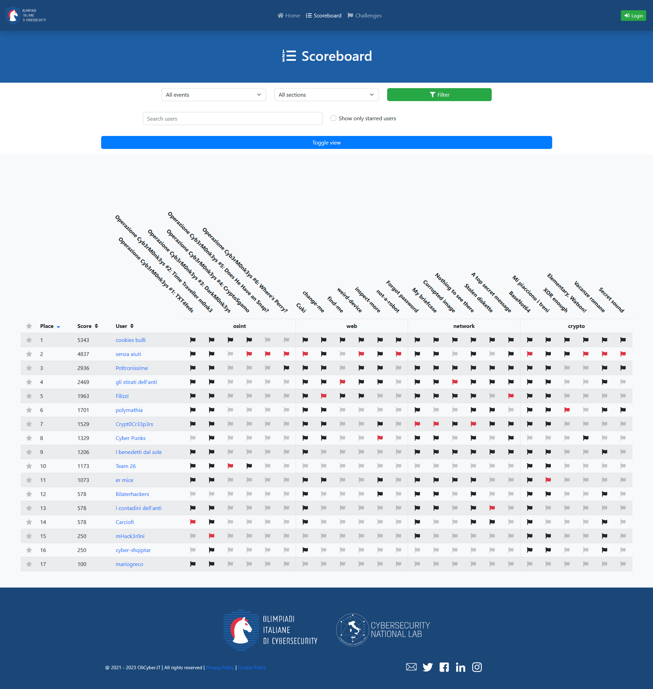

# HighSchools CTF Workshop - Verona

Challenge per l'HighSchools CTF Workshop 2023 di Verona

## Credits

Le challenge qua presenti sono state sviluppate dai membri dei team [Cyb3rM0nk3ys](https://cybermonkeys.it/) di Verona per il terzo HighSchools CTF Workshop tenutosi al 311 Verona il 28 Novembre 2023.

## Challenges

| Category  | Title                                                       | Author                           |      Dynamic       | Type |                             Url | Port |
| :-------- | :---------------------------------------------------------- | :------------------------------- | :----------------: | ---: | ------------------------------: | :--: |
| crypto    | [BaseNot64](crypto01)                                       | Cristiano Di Bari <@cridiba>     |        :x:         |      |                                 |      |
| crypto    | [Mi piacciono i treni](crypto02)                            | Cristiano Di Bari <@cridiba>     |        :x:         |      |                                 |      |
| crypto    | [XOR enough](crypto03)                                      | Cristiano Di Bari <@cridiba>     |        :x:         |      |                                 |      |
| crypto    | [Elementary, Watson!](crypto04)                             | Cristiano Di Bari <@cridiba>     |        :x:         |      |                                 |      |
| crypto    | [Vacanze romane](crypto05)                                  | Cristiano Di Bari <@cridiba>     |        :x:         |      |                                 |      |
| crypto    | [Secret sound](crypto06)                                    | Cristiano Di Bari <@cridiba>     |        :x:         |      |                                 |      |
| network   | [Forgot password](network01)                                | Alessandro Righi <@alerighi>     |        :x:         |      |                                 |      |
| network   | [My briefcase](network02)                                   | Alessandro Righi <@alerighi>     |        :x:         |      |                                 |      |
| forensics | [Corrupted image](network03)                                | Alessandro Righi <@alerighi>     |        :x:         |      |                                 |      |
| forensics | [Nothing to see there](network04)                           | Alessandro Righi <@alerighi>     |        :x:         |      |                                 |      |
| forensics | [Stolen diskette](network05)                                | Alessandro Righi <@alerighi>     |        :x:         |      |                                 |      |
| network   | [A top secret message](network06)                           | Alessandro Righi <@alerighi>     |        :x:         |      |                                 |      |
| osint     | [Operazione Cyb3rM0nk3ys #1: TXT4feds](osint01)             | Simone Di Maria <@simonedimaria> |        :x:         |      |                                 |      |
| osint     | [Operazione Cyb3rM0nk3ys #2: Time Traveller m0nk3](osint02) | Simone Di Maria <@simonedimaria> |        :x:         |      |                                 |      |
| osint     | [Operazione Cyb3rM0nk3ys #3: DarkM0nk3ys](osint03)          | Simone Di Maria <@simonedimaria> |        :x:         |      |                                 |      |
| osint     | [Operazione Cyb3rM0nk3ys #4: CryptoSgamo](osint04)          | Simone Di Maria <@simonedimaria> |        :x:         |      |                                 |      |
| osint     | [Operazione Cyb3rM0nk3ys #5: Does He Have Snap?](osint05)   | Simone Di Maria <@simonedimaria> |        :x:         |      |                                 |      |
| osint     | [Operazione Cyb3rM0nk3ys #6: Where's Perry?](osint06)       | Simone Di Maria <@simonedimaria> |        :x:         |      |                                 |      |
| web       | [Cuki](web01)                                               | Davide Saladino <@uncavo-hdmi>   | :heavy_check_mark: | http |         cuki.challs.olicyber.it |  80  |
| web       | [change-me](web02)                                          | Davide Saladino <@uncavo-hdmi>   | :heavy_check_mark: | http |    change-me.challs.olicyber.it |  80  |
| web       | [find-me](web03)                                            | Davide Saladino <@uncavo-hdmi>   | :heavy_check_mark: | http |      find-me.challs.olicyber.it |  80  |
| web       | [weird-device](web04)                                       | Davide Saladino <@uncavo-hdmi>   | :heavy_check_mark: | http | weird-device.challs.olicyber.it |  80  |
| web       | [inspect-more](web05)                                       | Davide Saladino <@uncavo-hdmi>   | :heavy_check_mark: | http | inspect-more.challs.olicyber.it |  80  |
| web       | [not-a-robot](web06)                                        | Davide Saladino <@uncavo-hdmi>   | :heavy_check_mark: | http |  not-a-robot.challs.olicyber.it |  80  |

## Scoreboard

