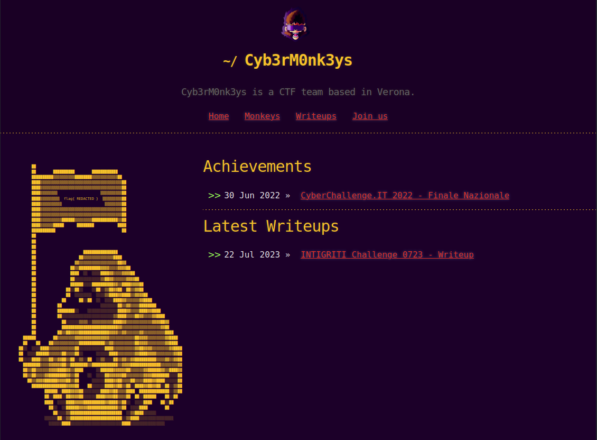
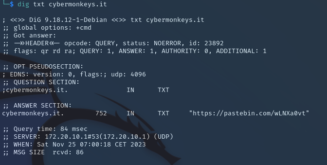
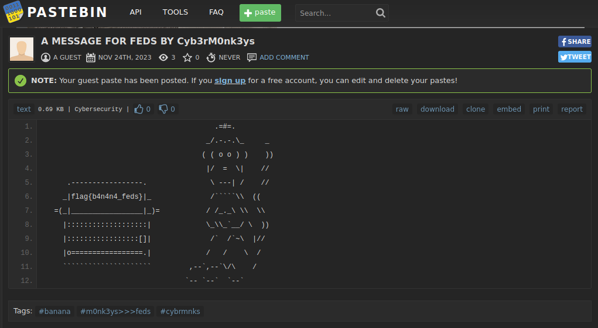

# 3rd HighSchools CTF Workshop - Verona 2023

## [osint] Operazione Cyb3rM0nk3ys #1: TXT4feds

Prima challenge dell'Operazione Cyb3rM0nk3ys, i players dovranno fare enumerazione base di un dominio internet.

Come il titolo della challenge suggerisce, la flag si trova (in un pastebin linkato) nei **TXT DNS records del dominio**, che si possono leggere con un semplice `dig txt cybermonkeys.it` o un qualsiasi tool online come [osint.sh](https://osint.sh/dns).

### Soluzione

Siamo gli investigatori in carico di raccogliere più informazioni possibili riguardo la cybergang dei Cyb3rM0nk3ys attraverso l'Open Source Intelligence (OSINT).  
Per iniziare ci viene dato solo un dominio internet, che istintivamente ci porta per prima cosa a visitarlo.



Purtroppo, a prima vista non troveremo informazioni utili.  
 Tuttavia, dalle fantastiche slides presentate dal miglior speaker del CHS Verona, siamo venuti a conoscenza del Domain OSINT, di conseguenza è una delle prime cose che andremo a fare trovandoci davanti un dominio internet:

- Per prima cosa facciamo un semplice WHOIS sul dominio

```txt
└─$ whois cybermonkeys.it

*********************************************************************
* Please note that the following result could be a subgroup of      *
* the data contained in the database.                               *
*                                                                   *
* Additional information can be visualized at:                      *
* http://web-whois.nic.it                                           *
*********************************************************************

Domain:             cybermonkeys.it
Status:             ok
Signed:             no
Created:            2023-11-23 22:41:15
Last Update:        2023-11-23 22:41:15
Expire Date:        2024-11-23

Registrant
  Organization:     hidden

Admin Contact
  Name:             hidden
  Organization:     hidden

Technical Contacts
  Name:             Technical Support
  Organization:     Register SpA
  Address:          Via Zanchi 22
                    Bergamo
                    24126
                    BG
                    IT
  Created:          2009-09-28 11:01:09
  Last Update:      2020-12-09 16:18:25

Registrar
  Organization:     Register S.p.a.
  Name:             REGISTER-REG
  Web:              https://www.register.it
  DNSSEC:           yes


Nameservers
  ns1.register.it
  ns2.register.it
```

Il che non rivelerà informazioni utili.

- Proviamo dunque ora a leggere i DNS records, per farlo utilizzeremo il tool `dig` o un qualsiasi tool online come [osint.sh](https://osint.sh/dns).  
  `dig any cybermonkeys.it` per leggere tutti i DNS records  
  oppure  
  `dig txt cybermonkeys.it` per leggere in particolare i DNS records di tipo TXT.



Notiamo un pastebin linkato in un TXT record, visitandolo troveremo un messaggio particolare per i federali da parte dei Cyb3rM0nk3ys.



> flag{b4n4n4_feds}
