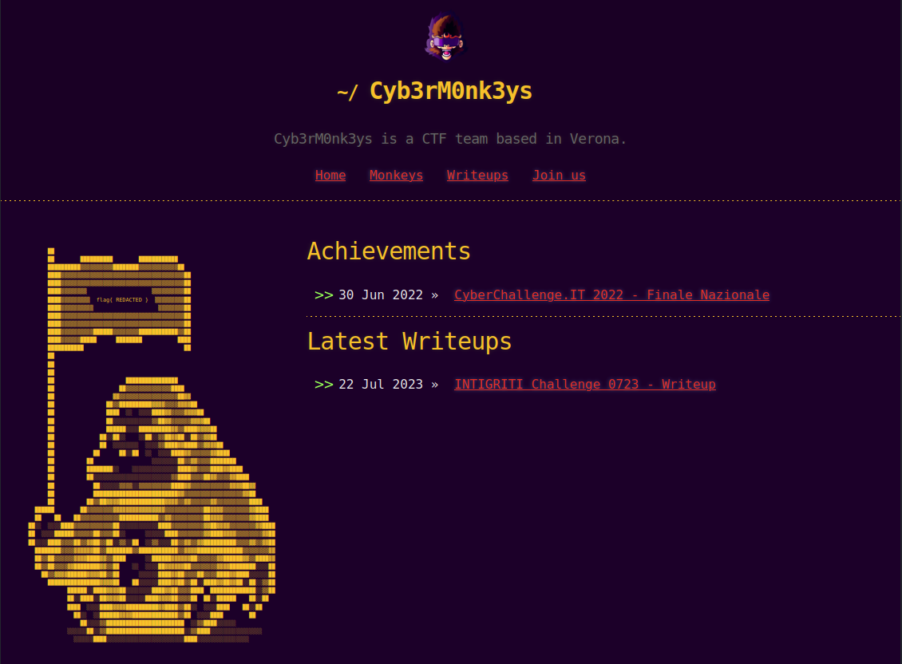
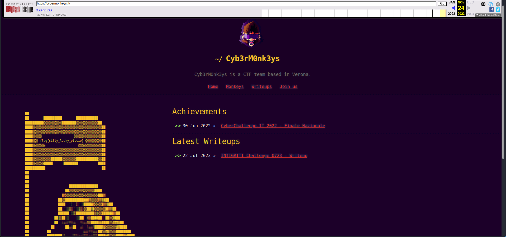
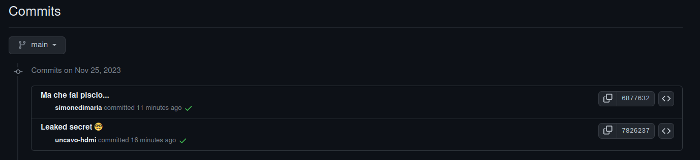
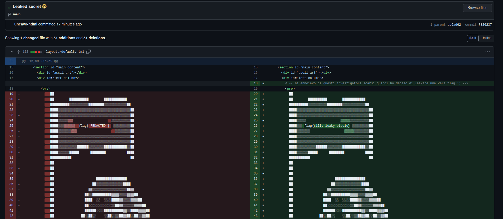
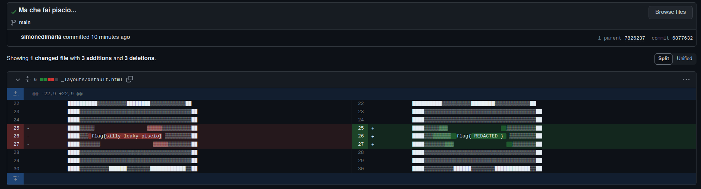

# 3rd HighSchools CTF Workshop - Verona 2023

## [osint] Operazione Cyb3rM0nk3ys #2: Time Traveller m0nk3

Nella seconda challenge dell'Operazione Cyb3rM0nk3ys, i players dovranno indagare di più sul sito del team. Come già visto nella challenge precedente, sul sito attuale non troveranno informazioni interessanti, ma con qualche indizio si arriva a capire che qualche informazione è stata cancellata.  
 Provando a vedere degli snapshot del sito sulla [Wayback Machine](https://archive.org/web/) troveranno la flag, oppure per i più skillati guardando dai commit del sito, essendo hostato su github.

### Soluzione

Ci viene richiesto di raccogliere altre informazioni sul sito della cybergang dei Cyb3rM0nk3ys.  
Ci viene suggerito che il sito ha avuto più versioni, e se notiamo la flag dentro l'ascii art della scimmia è "REDACTED"... direi qualcosa che vale la pena cercare.

Con queste informazioni, insieme all'indizio fornito nella descrizione della challenge (ossia il presentimento che quella pagina in passato fosse diversa) ci porta a pensare che del contenuto una volta presente nel sito, ora è stato modificato o cancellato.

Ci interessa dunque provare a cercare snapshot storici del sito.  
La [Wayback Machine](https://archive.org/web/) in questo caso ci torna molto utile, ma sapendo che il sito è hostato su github (per i più attenti) si può anche leggere nei commit passati sulla [repo pubblica del sito](https://github.com/Cyb3rM0nk3ys/Cyb3rM0nk3ys.github.io).  
Dunque per questa challenge ci sono **_2 possibili risoluzioni_**:

1. Guardando gli snapshot catturati dalla Wayback Machine per il sito cybermonkeys.IT si nota che sono presenti più di uno snapshot recenti, a partire dalla nascita del sito.  
   In particolare nello snapshot del 24 Novembre troveremo la nostra flag (non più "REDACTED").
   
2. La seconda possibile risoluzione riguarda il coinvolgimento della history dei commit del sito.
   Come i più attenti avranno notato che il sito è hostato su Github, avranno anche notato (dopo aver trovato l'org Github con lo stesso nome del team) che tra i commit ce n’è uno più interessante di altri:
   
   
   Il criminale "piscio" dei Cyb3rM0nk3ys ha leakato una flag...smh.  
   Flag successivamente rimossa nuovamente.
   

> flag{silly_leaky_piscio}
