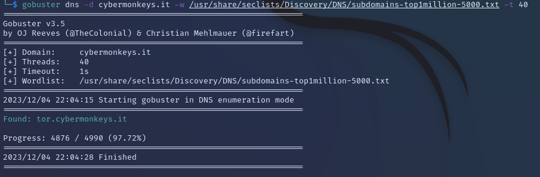
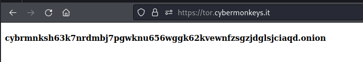
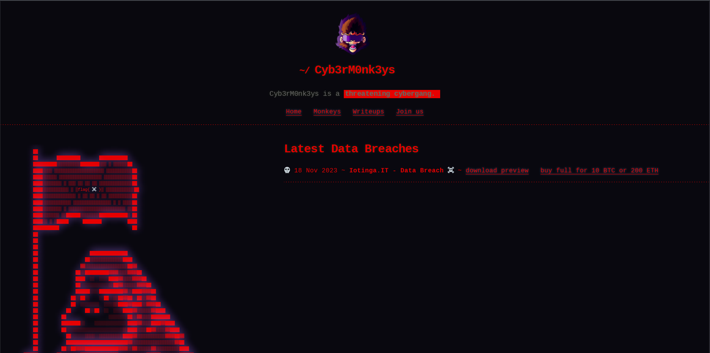
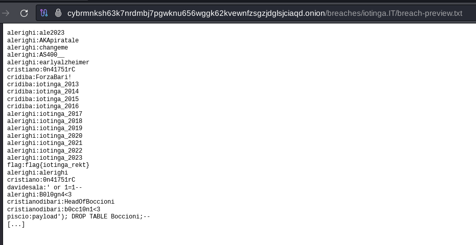

# 3rd HighSchools CTF Workshop - Verona 2023

## [osint] Operazione Cyb3rM0nk3ys #3: DarkM0nk3ys

In questa terza fase dell'operazione Cyb3rM0nk3ys i players dovranno fare un ulteriore enumerazione del dominio, esaminando pure i sottodomini. Essi riveleranno la presenza di un sottodominio particolare: `tor.cybermonkeys.it` (trovabile anche con un qualsiasi tool per enumerare sottodomini e la wordlist `subdomains-top1million-5000.txt`). Visitando questo sottodominio verrà rivelato l'indirizzo onion in cui è hostata la versione "oscura" del sito, con funzionalità (illegali) aggiuntive, come la possibilità di scaricare il data breach dell'azienda "Iotinga" e trovarne la flag dentro.

### Soluzione

Abbiamo enumerato le informazioni WHOIS, DNS del dominio, oltre ad aver visto i loro snapshot storici dalla Wayback Machine e dai commit su github.
In quale altro modo possiamo enumerare ulteriormente questo sito come ci viene chiesto per trovare "accessi nascosti"?  
Prima di tutto si cerca se esistono sottodomini, e per far ciò abbiamo due possibili metodi da poter usare:

- Enumerazione da wordlist, attraverso l'utilizzo di tool come `gobuster`:

```sh
gobuster vhost -u cybermonkeys.it -w /usr/share/seclists/Discovery/DNS/subdomains-top1million-5000.txt --append-domain
```



Indipendentemente dalla strada intrapresa, scopriremo l'esistenza del domino
`tor.cybermonkeys.it`

Che sia mai il link del tor per il Data Breach di Iotinga?



Ovviamente no, o meglio, non il link diretto ad esso, non essendo su canali sicuri.
Quello che ci viene dato dunque è un indirizzo onion da raggiungere.

#### Interazione con Tor Hidden Service (.onion)

Un motore di ricerca comune non ci permetterà di raggiungere questo dominio.
Per riuscirci dovremmo munirci di Tor Browser.
Per installarlo dovremmo recarci sul [sito ufficiale](https://www.torproject.org/it/download/) e (supponendo venga utilizzata una macchina Linux) basterà scaricare il `tar.gz` estrarlo, ed eseguire l'eseguibile che si troverà dentro. L'installazione su Windows è più intuitiva e potrebbe essere la strada intrapresa da molti.

Una volta scaricato Tor Browser, ci basterà mettere il nostro .onion nella barra di ricerca e ci troveremo alla versione Dark Web del sito dei Cyb3rM0nk3ys:



Notiamo intanto (oltre al tema diverso) che nel body troviamo il link (vero) per il download del Data Breach di Iotinga.
Al suo interno, oltre credenziali, troveremo la nostra flag.



> flag{iotinga_rekt}
