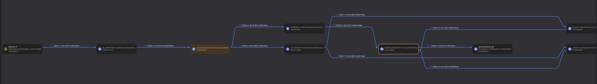

# 3rd HighSchools CTF Workshop - Verona 2023

## [osint] Operazione Cyb3rM0nk3ys #4: CryptoSgamo

Nella quarta challenge dell'Operazione Cyb3rM0nk3ys, i players, dopo aver visualizzato il dominio .onion, dovranno prendere l'indirizzo indicato per i pagamenti dei Data Breaches e utilizzarlo su un Block Explorer per capirne il recipiente finale, idealmente con un tool grafico come [MetaSleuth](https://metasleuth.io/) o [Arkham](https://platform.arkhamintelligence.com/) per semplicità. Troveranno un unico recipiente finale e il suo indirizzo sarà la flag.

### Soluzione

Nel dominio "oscuro" dei Cyb3rM0nk3ys abbiamo scoperto attività illecite come la diffusione e la vendita di Data Breaches nel deepweb, tra cui quello causato ai danni di Iotinga.  
Tra le opzioni c'era la possibilità di scaricare una preview del Leak o comprare direttamente l'intero Leak per una controparte in cryptovalute.  
Visualizzando la pagina di pagamento notiamo come non sia più disponibile comprare, e come le informazioni di pagamento siano state oscurate ma non cancellate.
Prendiamo dunque l'indirizzo che inizia con `0x` e iniziamo a tracciarne i movimenti come ci viene chiesto.  
Per far ciò si può scegliere di:

- Visualizzare a mano le transazioni su un block explorer come [Etherscan](https://etherscan.io/) per avere più controllo sulla visualizzazione delle transazioni, oppure
- Utilizzare un tool visivo come [MetaSleuth](https://metasleuth.io/) o [Arkham](https://platform.arkhamintelligence.com/) per plottare graficamente i movimenti e avere un'idea più chiara ed immediata del recipient finale (consigliato).

Prendendo d'esempio MetaSleuth (che non richiede registrazione) vediamo come i movimenti dell'indirizzo girino tra qualche indirizzo, quasi per offuscarne il recipiente, per poi fluire tutti all'indirizzo `0x1E3BA157c946D1e6EaF228834D80F85D2460D3eF` che inoltre possiede un dominio Web3 chiamato `perrythepwner.eth` che potrebbe tornare utile per le challenge successive.  
L'indirizzo effettivo di `perrythepwner.eth` sarà la nostra flag.

> flag{0x1E3BA157c946D1e6EaF228834D80F85D2460D3eF}  
> flag{0x1e3ba157c946d1e6eaf228834d80f85d2460d3ef}
