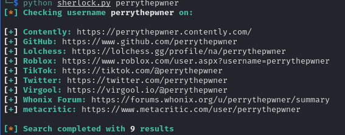
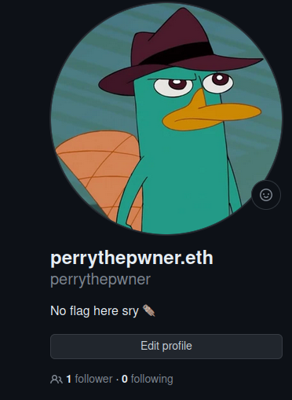
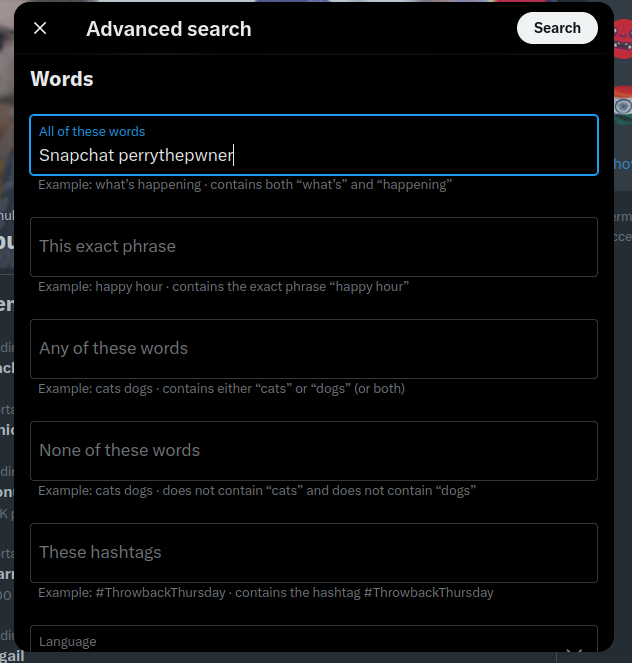
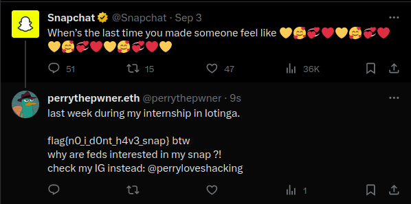

# 3rd HighSchools CTF Workshop - Verona 2023

## [osint] Operazione Cyb3rM0nk3ys #5: Does He Have Snap?

Nella quinta challenge dell'Operazione Cyb3rM0nk3ys, verrà richiesto di fare un po' di Social OSINT sull'alter ego di uno dei membri del team, a partire dall'username appena rivelato dal dominio Web3. La flag si troverà in un commento su Twitter sul profilo Twitter ufficiale di Snapchat.

Si può trovare con facilità con la ricerca avanzata di twitter edusando la keywords "Snapchat" e "perrythepwner" oppure semplicemente leggendo le ultime replies sul proflio Twitter.

### Soluzione

Ottimo, siamo finalmente risaliti ad un'identità nuova. Ci siamo quasi!  
Ci viene chiesto di risalire ai profili di perrythepwner(.eth) a partire da questo username.
Per questo compito si possono utilizzare diversi tool di Social Media Lookup.  
Alcuni esempi sono:

- [IDCrawl](https://www.idcrawl.com/username)
- [discoverprofile](https://discoverprofile.com)
- [Sherlock](https://github.com/sherlock-project/sherlock) (CLI)

Per fini dimostrativi utilizzeremo Sherlock perchè è più figo, ma i players possono utilizzare un qualsiasi tool online, una google dork o addirittura a mano, essendo che non ci sono tanti profli su social noti con quell'username.

Lanciando una semplice ricerca con sherlock troveremo diversi profili social, di cui però la maggior parte sono in realtà inesistenti, tranne Twitter, Github e Roblox (questo non l'ho fatto io, ho provato a segnalarlo per toglierlo ma niente :( piccolo rabbit hole(?)).
Focalizzandosi sui social seri vedremo come sul Github non ci sarà nulla di interessante, e ce lo dirà pure la descrizione:

Su twitter invece troveremo molta più attività.
Come il titolo e la descrizione della challenge ci suggerisce potremmo provare a cercare qualcosa relativo ad Snapchat, possibilmente utilizzando la [ricerca avanzata di twitter](https://twitter.com/search-advanced).  
Come parole chiave possiamo utilizzare ad esempio:

- Snapchat
- perrythepwner
- perrythepwner.eth

Avremo un solo risultato con la risposta sul profilo ufficiale di Snapchat con la flag (e un input per l'ultima challenge).

> flag{n0_i_d0nt_h4v3_snap}
