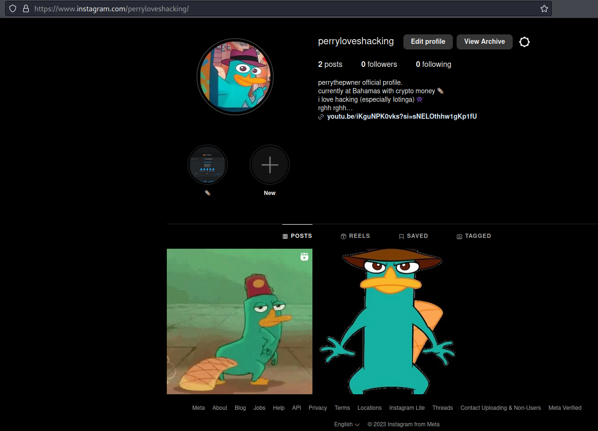
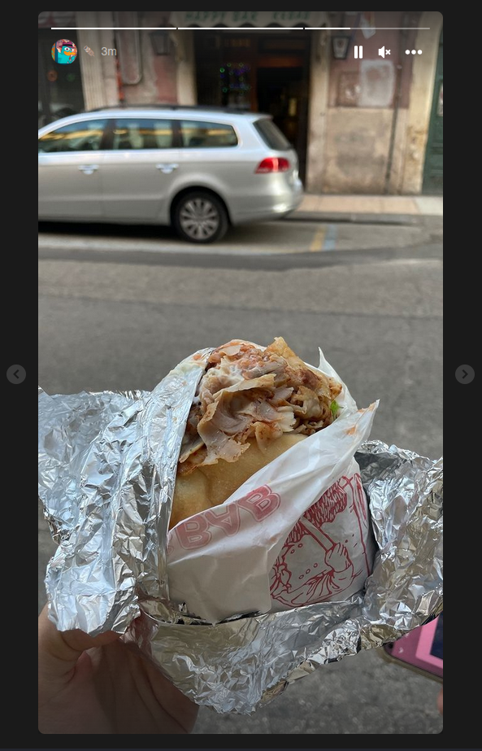
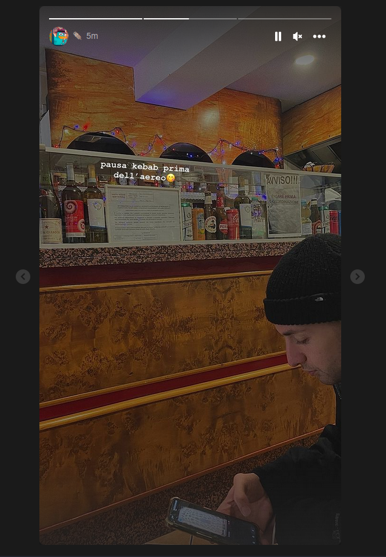
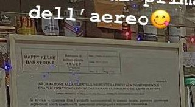
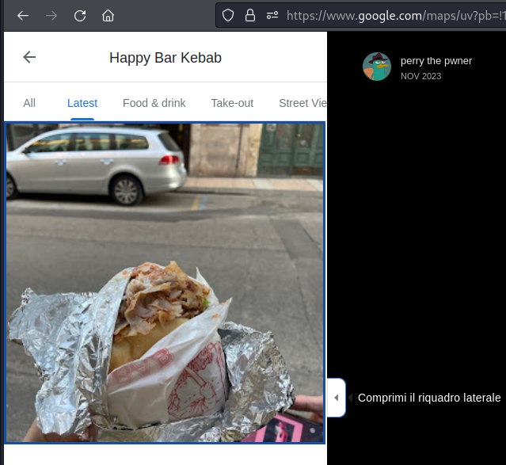
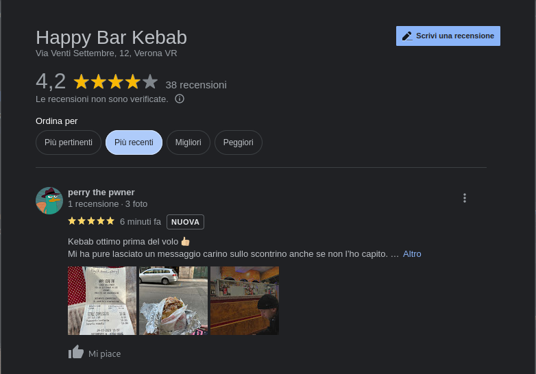
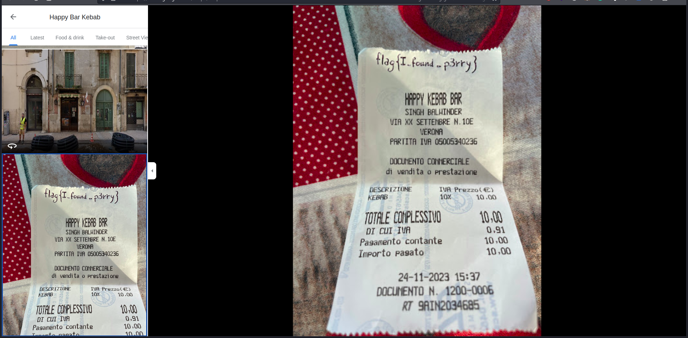

# 3rd HighSchools CTF Workshop - Verona 2023

## [osint] Operazione Cyb3rM0nk3ys #6: Where's Perry?

Nella sesta ed ultima challenge dell'Operazione Cyb3rM0nk3ys, i players, dovranno investigare sul profilo instagram personale di Perry fornito dalla challenge precedente, per trovare delle storie in evidenza ad un kebab. Dovranno poi localizzare il kebabbaro e leggere la flag nelle recensioni su Google Maps.

### Soluzione

Finalmente! Ci siamo, lo abbiamo quasi preso.  
Dobbiamo adesso localizzarlo. Dalla challenge precedente conosciamo il suo handle su Instagram del suo profilo personale, un buon punto di partenza.

Visualizzando il profilo vedremo qualche post - con nulla di interessante - e delle storie in evidenza.  
Guardando le storie in evidenza saltano all'occhio due storie in particolare, da un kebabbaro.

Aguzziamo la vista e cerchiamo di trovare informazioni interessanti nelle foto.  
In particolare, facendo Zoom In in entrambe le foto riusciamo a vedere il nome del kebabbaro:

Cerchiamolo su Google Maps.

Trovato!
...siamo sicuri sia questo? Beh, cerchiamo conferme.  
Guardando nelle recensioni, infatti troveremo una recensione da parte di Perry con la foto di uno scontrino e la flag!

> flag{I_found_p3rry}
