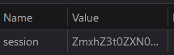

# 3rd HighSchools CTF Workshop - Verona 2023

## [web] cuki

Come suggerito dal sito, la challenge è relativa ai cookies. Utilizzando i DevTools possiamo ispezionare quali cookies sono presenti sul sito.

Notiamo il cookie di sessione, codificato base64. Possiamo ora utilizzare qualsiasi tool online per decodificare il cookie e otteremo la flag.
