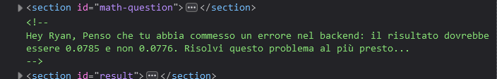

# 3rd HighSchools CTF Workshop - Verona 2023

## [web] inspect-more

Per risolvere l'esercizio è sconsigliato utilizzare il metodo corretto, in quanto il risultato è volutamente sbagliato. Andando ad analizzare il source code della pagina, si trova il commento di uno sviluppatore che suggerisce la risposta corretta.

Inserendo tale numero come risposta si otterrà la flag.
